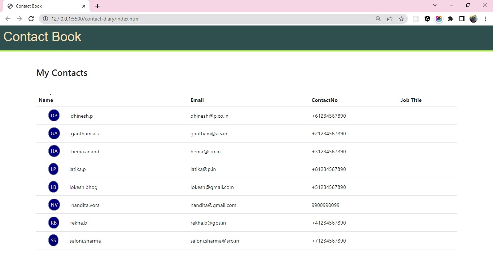

## Hackathon - Display Contact List

### Context

Prime solutions is an IT solutions provider company who have earned reputation in providing IT solutions in different business domains.

Recently they have received a project to develop contact book app.

Prime solutions have approached Graffitti designers for a good UI design.

The design is ready and now it needs to be made functional.

The development will be carried out in stages.

In the first two stages, inputs are captured, validated and posted to server.

The project has entered its third stage of development.

In this stage, you as a frontend developer have to fetch the data and display it on UI.

### Problem Statement

Fetch the details stored from contacts.json file through json-server

Display the key details, such as

- FirstName
- LastName
- Email
- Home Contact No

The contact list should be arranged in the alphabetical order by the firstname

The contact list should be displayed in tabular format as suggested below:

